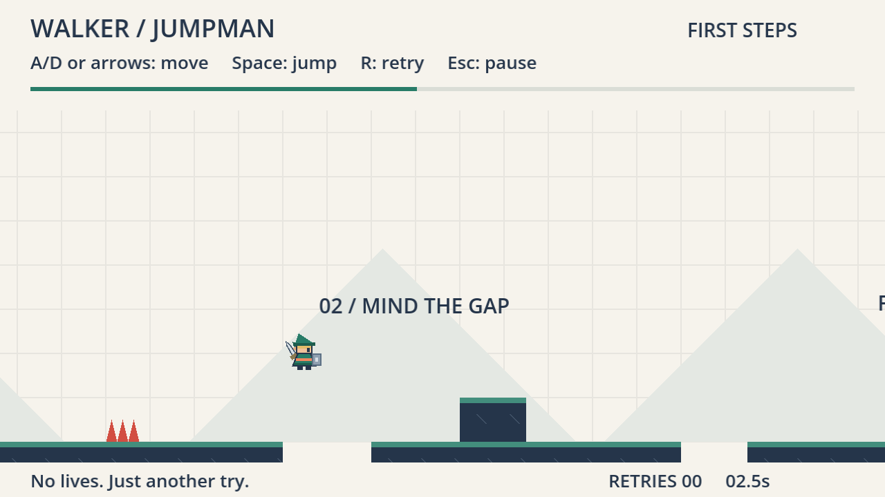

# walker-link — First Steps

**Playable source prototype · September 10, 2026 · Godot 4.7.2 / GDScript**

**Fork note.** `walker-link` is a coursework fork of [nikbearbrown/walker-jumpman](https://github.com/nikbearbrown/walker-jumpman) by Shuai Zhang. Two things differ from the starter: the player is drawn as a Link-styled adventurer instead of the starter's five-rectangle figure, and the level gains Section 03, which extends the world from 960 to 1480 pixels. Movement tuning, the collider, the controls, the retry loop and the original section's geometry are unchanged. What changed, what it cost and what was measured is recorded in [CHANGE-BRIEF.md](CHANGE-BRIEF.md). Everything else on this page, and every other document in this repository, is the starter author's work and describes the starter's own September 10 build.

Standalone game repository: [nikbearbrown/walker-jumpman](https://github.com/nikbearbrown/walker-jumpman). This checkout contains only this game's source, design package, and test evidence—not the Walker toolkit or Brutalist. **Fork note:** it now also carries the walkthrough film's *recipe and evidence* under [`youtube/`](youtube/claude-liam-walker-link-walkthrough/); the rendered MP4, MP3s and raw captures are hosted off-repo and linked in [The film](#the-film) below.

Clone this fork with `git clone https://github.com/ShuaiZhang06/walker-link.git`, then import `walker-link/godot/project.godot` in the regular Godot editor. No .NET runtime or external assets are required. On macOS, the launcher below also works when Godot is installed in Applications; on other platforms, use the editor or `godot --path godot` from the cloned folder.

Double-click [walker-jumpman.command](walker-jumpman.command) to play. Press **Enter** to start; **A/D or arrows** to move, **Space** to jump, **R** to retry, and **Escape/P** to pause. Reach the flag. Retries are unlimited.



This simple level has two small ledges, two gaps, a spiked step to jump over, a high stone across a 144-pixel chasm, two spike hazards, and a finish. It is the control/retry slice, not the full three-zone/cherry design below. See [build results and limitations](BUILD-REPORT.md). To edit, import [godot/project.godot](godot/project.godot) into Godot.

The first Walker example is a compact 2D platformer built around readable jumps, optional cherries and quick retries. Every new game project uses the `walker-` prefix. The original `jumping-man-godot` recovery collection remains separate and unchanged; it is not included or required here. Historical design references to sibling recovery files refer to the author's local source collection, not files shipped in this repository.

## The film

> *This section is the fork's, not the starter author's.*

**Walker, Forked.** — the required Brutalist Godot explainer for this build, made
with the course-provided `godot-waikthrough` skill (alias `godot-walkthrough`)
and its `walker` modifier. 5:09, landscape 3840 × 2160, 30 fps, English
narration (local Kokoro `am_onyx`, "Liam, in for Bear"), no captions. Every
gameplay frame is real Godot engine capture of **this** revision, driven by
scripted keyboard input — no teleports, no state writes, no re-created mock-up.

**▶ Watch:** `PASTE_MEDIA_LINK_HERE`
*(the MP4 is over GitHub's limit and is stored in the course media storage; the
link goes here once uploaded — see [Verifying the film](#verifying-the-film))*

| | |
| --- | --- |
| File name | `claude-liam-walker-link-walkthrough.mp4` |
| SHA-256 | `7a1e0ab0d2464de276d02497f3bf9bd6fc901c774a3269d561bca699cfa8d366` |
| Size | 30,646,281 bytes (30.6 MB) |
| Duration | 309.53 s (9,285 frames at 30 fps) |
| Format | H.264 3840 × 2160 + AAC 48 kHz stereo |
| Game revision demonstrated | `19a7ddd` · source snapshot `5e7724383ac2b2d076f47e34851dbf80bbb940b0e0f62071efd707f4bfc8a311` |

### Verifying the film

Download the MP4 from the link above and check that it is the exact file this
repository describes:

```bash
shasum -a 256 claude-liam-walker-link-walkthrough.mp4
# 7a1e0ab0d2464de276d02497f3bf9bd6fc901c774a3269d561bca699cfa8d366
```

A re-encode by any hosting platform will change that hash — the checksum
identifies the master that was rendered here, not a streamed copy.

### The film's recipe and evidence, in this repository

Everything needed to audit or rebuild the film is committed under
[`youtube/claude-liam-walker-link-walkthrough/`](youtube/claude-liam-walker-link-walkthrough/):

| file | what it is |
| --- | --- |
| [`beat_sheet.json`](youtube/claude-liam-walker-link-walkthrough/beat_sheet.json) | the whole film as data: 18 beats, narration, shot plan, per-beat frame ranges. **The single source of truth for the script** |
| [`SCRIPT.md`](youtube/claude-liam-walker-link-walkthrough/SCRIPT.md) | the spoken script with timecodes, English + Chinese facing translation |
| [`PROMPTS.md`](youtube/claude-liam-walker-link-walkthrough/PROMPTS.md) | the two on-screen prompts, and which one is a labelled reconstruction |
| [`coverage.json`](youtube/claude-liam-walker-link-walkthrough/coverage.json) | 18 implemented features → capture, beat, time range, observation; 6 planned-but-unbuilt, with reasons |
| [`capture/run-0*-inputs.jsonl`](youtube/claude-liam-walker-link-walkthrough/capture/) | the driver's key/mouse events **and** per-frame engine state for all seven takes; `t = f / 30` maps any timecode to a physics tick |
| [`CAPTURE.md`](youtube/claude-liam-walker-link-walkthrough/CAPTURE.md) | how it was recorded, the `build_id` recipe, the two harness-only changes made to an isolated copy |
| [`RIFF.md`](youtube/claude-liam-walker-link-walkthrough/RIFF.md) · [`FACTCHECK.md`](youtube/claude-liam-walker-link-walkthrough/FACTCHECK.md) · [`SHOTLIST.md`](youtube/claude-liam-walker-link-walkthrough/SHOTLIST.md) | per-beat commentary with sources; every spoken number traced to a log, a check or a line of code; the slot list |
| [`_qc/WALKTHROUGH-REVIEW.md`](youtube/claude-liam-walker-link-walkthrough/_qc/WALKTHROUGH-REVIEW.md) | the human review: gate results, timing verified against the input logs, and the outro's missing-asset blocker |

The MP4, the MP3 narration, the seven raw 4K captures and the per-beat clips are
deliberately **not** in git — they exceed the size limit and are regenerable
from the files above plus the toolkit.

## Known limitations

*This section is the fork's.* The starter's own limits are in
[BUILD-REPORT.md](BUILD-REPORT.md); the fork's are in
[TEST-REPORT.md §5](TEST-REPORT.md) and [FRICTIONAL.md](FRICTIONAL.md).
Attribution and licensing for everything used — the starter, the original art,
the engine, the toolkit, the voice model, the fonts, and the human/AI split —
is in [SOURCES.md](SOURCES.md).

- **One playtester — the author.** No first-time completion times, and no
  fairness, difficulty or enjoyment verdict from anyone else.
- **Whether the sword and shield read as props rather than as hitbox is still
  open** (prediction F6). They overhang the 18 × 28 collider by up to 4.5 px and
  carry no collision shape; no automated check can settle how that reads.
- **Not built, and not claimed:** cherries, the full three-zone course, any
  audio, a settings screen, key remapping, moving platforms, a Web export.
- **The scripted route is a fixture, not a player.** It shows the course is
  completable in 8.82 s with 0 deaths; it does not model how a person plays.
- **Coyote and buffer boundary unit cases seed controller timing state**
  directly. The film demonstrates both windows by playing them instead, but the
  unit fixtures remain fixtures.
- **The film's outro card is silent.** The locked jingle lives in the toolkit's
  gitignored `svg/claude/mp3/`, which is absent from that checkout; it is
  reported as an asset blocker rather than replaced with a substitute.
- **No export, no Web build, no publication, and nothing pushed to `upstream`.**
  The starter repository is unmodified.

## Read in this order

1. [Game brief](GAME-BRIEF.md) — the short player-facing idea and proposed scope.
2. [Detailed GDD](GDD.md) — sixteen design sections, source evidence, requirements and twenty-two acceptance cases.
3. [Level design](LEVEL-DESIGN.md) — the three-zone course and its untested geometry.
4. [Production plan](PRODUCTION-PLAN.md) — twenty-two dependency-ordered tasks across six phases, plus four deferred tasks.
5. [Playtest plan](PLAYTEST-PLAN.md) — mechanical tests, formative human sessions, evidence and revision rules.
6. [Asset plan](ASSET-PLAN.md) — original greybox requirements and the provenance boundary.
7. [Design status](DESIGN-STATUS.json) — machine-readable revision, decisions, pending approvals and honest runtime state.


[Design consistency review](DESIGN-REVIEW.md) · [Editable SVG map](design/level-overview.svg)

[Level coordinate data](design/level-01.json) drives this candidate blockout. Counts and geometry can be checked without Godot. Jump reachability, zero-cherry/all-cherry routing, camera behavior and enjoyment have not been tested.

## Proposed defaults ready for review

Godot 4 with typed GDScript, Compatibility rendering, one three-zone level, twenty optional cherries, one fixed-height jump with small forgiveness windows, hazards, quick retries, keyboard controls and a locally tested Web export. No paid services. No moving-platform dependency in the MVP.

The tested engine is Godot 4.7.2.stable.official.ed1daf0bf. Zelda's reusable prompt and command/workflow specification belong to the separate Walker toolkit and are not dependencies of this game.

## Current boundary

The full design is still a draft. Bear subsequently authorized **“Build a simple level for walker-jumpman.”** The first slice is implemented and machine-tested; full-design approvals, human playtesting, cherries/settings, and the Web export remain pending. This is a source-code release, not a hosted game or downloadable executable. The build report and test receipts preserve the earlier local-build history.

Next: play this small control/retry loop before expanding the course. The human owns intent, scope, play-feel judgments, and release decisions; AI implements and checks authorized work. The original `/Users/bear/walker-jumpman` stays untouched.
